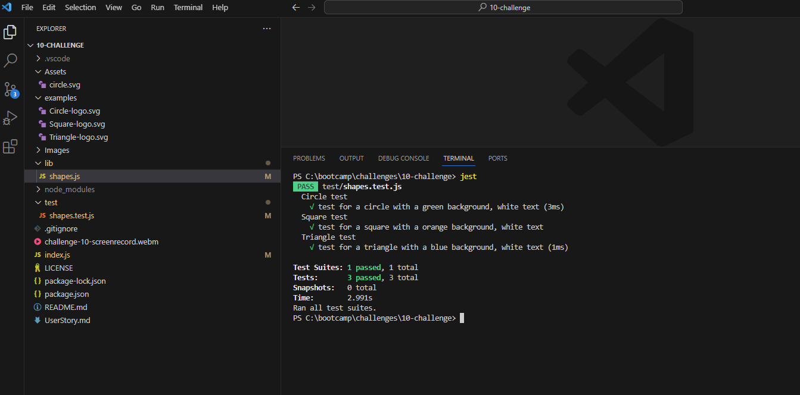

# 10-challenge

## Description

CLI application on creating a SVG image

## Installation

https://github.com/justin-hunter1/10-challenge

## License

refer to LICENSE in repo.

## Credits

obtained some advise from co-worker on moving switch statement from shapes.js to index.js. Which assisted in resolving some issues with executing jest test.

## screenshots

## To-Do's

